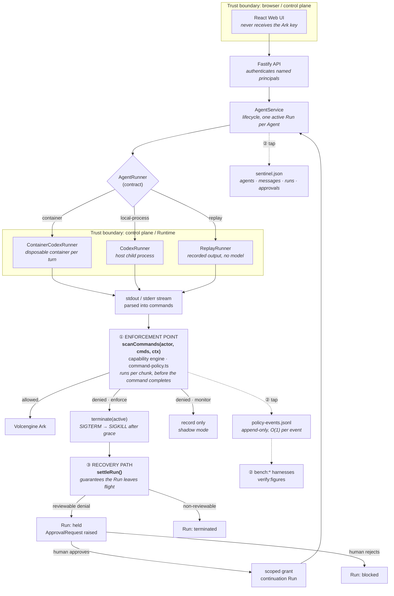

# Architecture

Sentinel is a single-node control plane that governs what a coding Agent is
allowed to do, on the Agent's own output stream, while the Agent is still
running.

The three things worth locating in the diagram below are labelled in it:

- **① Enforcement point** — where a command is judged and the Runtime is killed.
- **② Instrumentation taps** — where evidence leaves the hot path.
- **③ Recovery path** — what happens after a denial, including the human loop.



**Why the enforcement point is on the stream and not on a result.** Codex emits
`item.started` carrying the full command with `exit_code: null` *before* the
command finishes, so the engine reacts during execution rather than after it.
That is a race, and it is measured rather than asserted: teardown p50 is 1–3 ms
from denial to a dead Runtime. The final unterminated stdout line is scanned too,
so a command in the last flush cannot escape.

---

## The two state machines

These are different machines and the previous version of this document showed
only one of them, under a heading about the other. `held` — the state the entire
approval story turns on — was undocumented.

**Agent.** Lifecycle of the long-lived object.

```text
ready ──► busy ──► ready
  │        │
  ▼        ▼
stopped   error
```

**Run.** One turn. Eight states, and the branch after a denial is the reason the
approval loop exists at all.

```text
queued ──► running ──┬──► completed
                     ├──► failed        (runner or model error)
                     ├──► cancelled     (operator, or interrupted + restarted)
                     ├──► terminated    (policy denial, not reviewable)
                     ├──► held ──┬──► completed   (approved → scoped grant)
                     │           └──► blocked     (rejected)
                     └──► blocked       (denied outright)
```

| Run state | Set by | Means |
| --- | --- | --- |
| `queued` | `AgentService` | Accepted, not yet started. |
| `running` | runner | Streaming; the enforcement point is live. |
| `completed` | runner | Finished with no standing violation. |
| `failed` | `settleRun` | Runner or model failure. The Agent parks at `error`. |
| `cancelled` | operator / restart | Interrupted Runs become `cancelled` on restart. |
| `terminated` | enforcement | Denied by a non-reviewable rule; Runtime killed. |
| **`held`** | enforcement | **Denied by a reviewable rule (by default, network egress). The Runtime is dead and an `ApprovalRequest` is open. A human sees the command and the reason and decides.** |
| `blocked` | approval | A human rejected the held Run, or the denial was never appealable. |

An approval is a **scoped grant**: it unblocks that request, not the policy. The
approver is derived from the credential, never from the request body, so the
identity an approval records is the identity that authenticated.

---

## Components

### Web UI

Lists Agents, manages lifecycle actions, submits prompts, polls Runs, and renders
the live Security Evaluation. It never receives the Ark API key.

### Fastify API

Validates requests, authenticates callers as named principals from
`APP_PRINCIPALS`, and serves the compiled Web UI. The credential establishes
identity — the id it resolves to is what an approval records — but not
authorization: every configured principal may do everything.

### AgentService

Coordinates lifecycle state, persistence, workspaces and Runs. One Agent can have
only one active Run. `settleRun` wraps both the opening `running` write and the
terminal write, so a Run cannot be stranded by a failed audit write — see
Recovery.

### Storage

```text
data/sentinel.json                    schema v3: agents, messages, runs, approvals
data/sentinel.policy-events.jsonl     append-only audit log, one event per line
workspaces/AgentID/                   Agent-created files
workspaces/.deleted/                  archived deleted workspaces
codex-home/                           Codex configuration and sessions
```

`JsonStore` serialises writes and atomically replaces the JSON file. **Policy
events are not in that file.** They are appended to a JSONL log beside it, one
line per event, so recording decision *n* does not cost O(*n*).

> Until recently this section read *"`JsonStore` serializes writes and atomically
> replaces one JSON file"* with no further qualification. That was true when
> written and became, without being edited, a description of a defect that had
> been removed — recording one decision used to re-serialise every prior decision
> (14.16–17.59 ms at 5,000 events; now flat). A document can outlive its subject
> exactly the way a test can, and neither announces it. Recorded in the
> five-failure-mode taxonomy in
> [EVALUATION_RELIABILITY_PLAN.md](EVALUATION_RELIABILITY_PLAN.md) as a
> **stale subject**, one layer up from the r² gate that asserted the same defect.

Retention (`AUDIT_RETENTION_DAYS`) applies to both: resolved approvals are pruned
on write, and events are compacted when the log loads. Age is a property of a
record, not of a write.

### Runtime providers

| Provider | Execution | Used for |
| --- | --- | --- |
| `ContainerCodexRunner` | One disposable Docker/Colima/Podman container per turn | Local POC |
| `CodexRunner` | Codex child process in the application container | ECS |
| `ReplayRunner` | Recorded model output; **nothing is spawned** | Demo and CI, no key |

All three use argv-only process execution, bound output and time, resume the
stored Codex thread, and escalate termination after a grace period.

`ReplayRunner` fakes the model and nothing else — the API, the service, the
store, the policy engine and the approval loop are the real ones. It therefore
**does not prove containment**, and says so at the end of every run.

#### Write roots are declared per runner

The `file-write-outside-workspace` rule needs to know which directory trees this
run may write into. That is not a platform constant — it depends on the sandbox
the runner actually provides, so each runner passes its own list to
`policyContextFrom`:

| Runner | Write roots | Why |
| --- | --- | --- |
| `ContainerCodexRunner` | `/workspace`, `/tmp`, `/var/tmp` | The container is `--rm` with two bind mounts. Everything else is container-local and destroyed on exit, so scratch writes escape nothing. |
| `CodexRunner` | `request.workspacePath` only | Codex runs on the host. `/tmp` is the real host `/tmp`, genuinely outside the workspace. |

The consequence is deliberate: `git diff > /tmp/patch.diff` is ordinary work
under the container runner and a hard denial under the host-process runner.

---

## Instrumentation ② and recovery ③

**Instrumentation.** Every policy decision — allowed or denied, enforce or
monitor — is appended to the event log with its rule, command, detail and
timestamp. The log is what the dashboard reads, what the benchmarks score, and
what an operator reviews. Evidence is redacted before storage, so a leaked record
carries no secret material.

**Recovery.** Three distinct paths, all drawn as edges above rather than left to
prose:

1. **Runtime death.** A denied command terminates the Runtime — SIGTERM, then
   SIGKILL after a grace period. Detection is not containment: the benchmark
   checks the process actually died, not that a rule fired.
2. **Run settlement.** `settleRun` guarantees the Run leaves flight even when its
   own evidence write fails. Before it, a throwing audit write stranded the Run
   at `running` and the Agent at `busy`, and every later message failed with 409
   for the life of the process. Gated in `e2e.test.ts` as
   `"audit write fails mid-decision"`.
3. **Human loop.** A reviewable denial holds the Run and raises an
   `ApprovalRequest`. Approval issues a scoped grant and a continuation Run;
   rejection blocks it.

---

## Deployment profiles

| Profile | Control plane | Agent execution | Needs |
| --- | --- | --- | --- |
| Local POC | Host Node.js | Disposable local container | Container engine, Ark key |
| ECS | Application container | Codex process, same container | Ark key |
| Local development | Host Node.js | Host Codex process | Codex binary, Ark key |
| **Replay** | Host Node.js | **Recorded output, nothing spawned** | **Nothing** |

---

## Extension seams

These exist and have implementations today. Their contracts are written up in
[CONTRACTS.md](CONTRACTS.md).

| Seam | Contract | Implementations today |
| --- | --- | --- |
| `AgentRunner` | Start a turn, stream output, terminate on demand | 3 — container, local process, replay |
| `scanCommandsWith` | Injectable evaluator behind a byte-identical `scanCommands` | 2 — the real engine, and a policy-off evaluator used to measure overhead |
| Figure contract | Every published number traces to the run its text cites | `scripts/verify-figures.mjs`, gated in CI |
| Ratchet contract | Named residual signatures; fails in **both** directions | `bench:generate`, `bench:injection`, `verify:figures` |

### Not built

Kept because they were the challenge's suggested tracks, and separated because
listing aspiration beside working seams makes both harder to read.

| Track | Where it would attach | Status |
| --- | --- | --- |
| Glass Box | `AgentRunner`, `AgentRun` | Not built — correlated execution events are recorded but not visualised as a trace. |
| Bouncer | API routes, Agent ownership | Partial — identity landed (named principals, credential-derived approvers); per-Agent authorization did not. |
| Kill Switch | Network layer | Not built — egress is governed by reading commands, not by network control. See Limitations in the README. |

---

## Trust boundaries

| Boundary | Crossed by | Guarantee |
| --- | --- | --- |
| Browser / control plane | HTTP + principal credential | The UI never receives the Ark key. |
| Control plane / Runtime | Process spawn, argv only | No shell on any path; a metacharacter-laden prompt arrives as one argument. |
| Runtime / network | The Agent's own commands | The enforcement point. Text-based, and that ceiling is documented. |
| Runtime / host filesystem | Declared write roots | Per-runner, fail-closed on an empty list. |

The container or ECS instance is the POC trust boundary. Ordinary containers are
not hardened multi-tenant isolation, and this is a hackathon control plane rather
than a production one.
