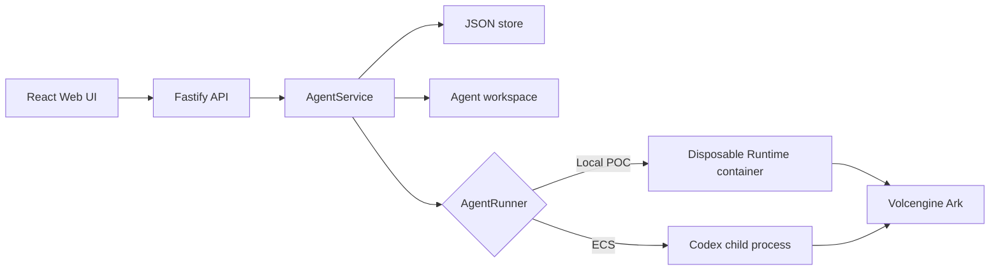

# Architecture

Volc Agent sentinel is a single-node control plane for hackathon use.



## Components

### Web UI

Lists Agents, manages lifecycle actions, submits prompts, and polls asynchronous
Runs. It never receives the Ark API key.

### Fastify API

Validates requests, authenticates callers as named principals from
`APP_PRINCIPALS`, and serves the compiled Web UI. The credential establishes
identity — the id it resolves to is what an approval records — but not
authorization: every configured principal may do everything.

### AgentService

Coordinates lifecycle state, persistence, workspaces, and Runs. One Agent can
have only one active Run.

```text
ready -> busy -> ready
  |       |
  v       v
stopped  error
```

Interrupted Runs become `cancelled` after a restart.

### Storage

```text
data/sentinel.json       Agent, message, and Run metadata
workspaces/AgentID/       Agent-created files
workspaces/.deleted/      Archived deleted workspaces
codex-home/               Codex configuration and sessions
```

`JsonStore` serializes writes and atomically replaces one JSON file. It supports
one process only.

### Runtime providers

- `CodexRunner` runs Codex inside the application container for ECS.
- `ContainerCodexRunner` starts one disposable Docker, Colima, or Podman
  container for every local turn.

Both providers use argv-only process execution, bound output and time, resume
the stored Codex thread, and escalate termination after a grace period.

#### Write roots are declared per runner

The `file-write-outside-workspace` policy rule needs to know which directory
trees this run may write into. That is not a platform constant — it depends on
the sandbox the runner actually provides, so each runner passes its own list to
`policyContextFrom`:

| Runner | Write roots | Why |
| --- | --- | --- |
| `ContainerCodexRunner` | `/workspace`, `/tmp`, `/var/tmp` | The container is `--rm` with exactly two bind mounts (`workspacePath → /workspace`, `codexHome → /codex-home`). Everything else in that filesystem is container-local and destroyed on exit, so a scratch write escapes nothing and touches no host path. |
| `CodexRunner` | `request.workspacePath` only | Codex runs directly on the host. `/tmp` is the real host `/tmp` and genuinely outside the workspace, so a write there is denied. |

The consequence is deliberate: `git diff > /tmp/patch.diff` is ordinary work
under the container runner and a hard denial under the host-process runner. The
rule is never reviewable and terminates the run, so declaring the container's
scratch dirs is what keeps a non-appealable control off legitimate commands.
Anything else absolute (`/etc`, `/usr`, `/codex-home`) is untrusted in both.

## Deployment profiles

| Profile | Control plane | Agent execution |
| --- | --- | --- |
| Local POC | Host Node.js | Disposable local container |
| ECS | Application container | Codex process in the same container |
| Local development | Host Node.js | Host Codex process |

## Extension seams

| Track | Primary seam | Expected change |
| --- | --- | --- |
| Glass Box | `AgentRunner`, `AgentRun` | Emit and display correlated execution events. |
| Bouncer | API routes, Agent ownership | Add identity and server-side authorization. |
| Kill Switch | `AgentRunner` | Add threat-specific policy or a stronger sandbox. |

The current container or ECS instance is the POC trust boundary. Ordinary
containers are not hardened multi-tenant isolation.
