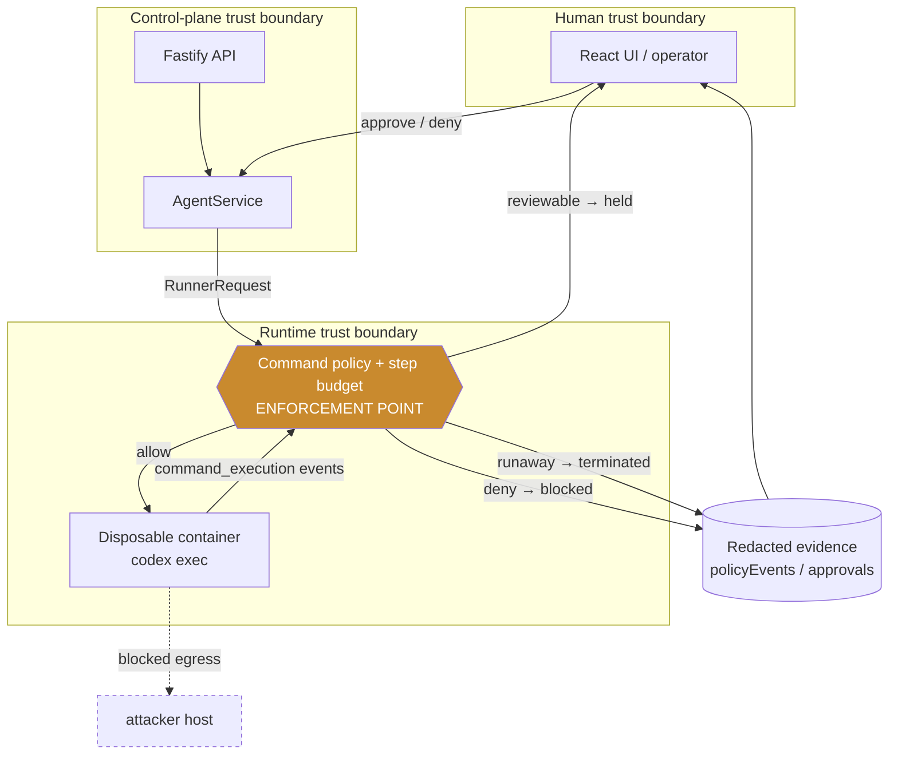

# Threat model: Agent Launchpad Kill Switch

Answers the four questions of the Threat Modeling Manifesto for this platform:
what we are working on, what can go wrong, what we do about it, and whether we
did a good enough job. The register is **code** (`apps/server/src/threat-model.ts`)
and **CI-enforced** (`threat-model.test.ts`): a `mitigated` claim fails the build
unless a real test tagged `@covers <id>` verifies it. Run `npm run threat-model`
for the live scorecard.

## 1. What we are working on

An agent platform where an LLM (Codex) executes real shell commands in a
per-agent container with a real credential in its environment and outbound
network access. The middleware added here is a **Safety Enforcement and Evidence
Gateway** on the command stream between orchestration and execution.

**Design principle (OWASP agentic guidance):** the LLM *proposes* an action; a
deterministic trusted component *authorizes* it. Model output, retrieved
documents, and tool results are all untrusted when they can influence a
consequential command. The model cannot bypass the gateway by phrasing a command
differently — every consequential path reaches the same enforcement point.

## 2. Trust boundaries

The consequential boundaries are not the network edges. They are:

- **human → agent** — an operator's benign request can carry an injected
  instruction from workspace data.
- **agent reasoning → deterministic execution** — where a proposed command is
  authorized or denied. This is the enforcement point.
- **runtime → external resource** — where egress is allowlisted.
- **runtime → persistent workspace** — where the protected `.secrets/` fixture
  lives.
- **control plane → runtime** — where the step budget bounds a run.

## 3. What can go wrong, and what we do about it

Eight threats are registered. Summary (full detail, attack paths, and residual
notes in the register):

| ID | Threat | Inherent | Control | Residual | Verified |
|----|--------|:--------:|--------|:--------:|:--------:|
| TM-AGENT-001 | Indirect prompt injection → unauthorized command | 20 CRIT | Deterministic command policy + redacted audit | 10 MED | ✅ |
| TM-AGENT-002 | Secret exfiltration to a recognisable non-allowlisted host | 20 CRIT | Recognisable-egress denial + hard secret rule + redaction | 10 MED | ✅ |
| TM-AGENT-003 | Obfuscated command evades the policy | 15 HIGH | Destination-based egress (any binary/scheme) | 10 MED | ✅ |
| TM-AGENT-004 | Runaway execution / denial of wallet | 12 MED | Platform step budget (always on) | 6 LOW | ✅ |
| TM-AGENT-005 | Consequential egress without oversight | 12 MED | Human approval, run-scoped host grant | 6 LOW | ✅ |
| TM-AGENT-006 | Cross-agent evidence leakage | 6 LOW | Per-agent scoping in the service | 3 LOW | ✅ |
| TM-AGENT-007 | Agent writes outside the sandboxed workspace | 9 MED | Workspace-scoped FILE_WRITE denial | 3 LOW | ✅ |
| TM-OPS-001 | Unbounded audit-log growth | 6 LOW | Redaction + retention bound (`AUDIT_RETENTION_DAYS`) | 2 LOW | ✅ |

**Scope note:** the egress control is a reactive command-text guard, not a
network allowlist — commands with an implicit destination (bare `npm install`,
`git push` to a preconfigured remote) are not blocked, and the container keeps
bridge networking. True default-deny needs network-layer enforcement (deferred).

Impact often stays high after mitigation: controls reduce probability and blast
radius, not the worst-case consequence.

**Two design choices that make the controls defensible:**

- **Secret rules are never reviewable.** Only the egress rules
  (`network-egress-denied`, `network-egress-denied-implicit`) can be held for
  human approval; `secret-exfiltration` and `protected-secret-access` are
  always hard-denied, so no operator can be fatigued into approving exfiltration.
- **The step budget is not a toggle.** Command policy can run in monitor mode;
  the resource budget always enforces, because a runaway loop must stop
  regardless.

## 4. Did we do a good enough job?

- **Verified-control rate: 8/8** mitigated threats have a passing test, enforced
  by CI. Removing a control's test fails the build and names the threat.
- **Negative testing:** 69 labelled attacks (incl. red-team and external-review probes) + 6 live
  red-team prompts against the running model. One residual bypass (base64 `eval`)
  is documented, not hidden.
- **Live end-to-end:** benign task completes; disallowed egress is blocked
  mid-flight; canary byte-identical; collector records zero requests; no
  orphaned container; recovery task completes; a held run is approved and
  resumes under a scoped grant.
- **No open items remain:** TM-OPS-001 (unbounded retention) is now mitigated by
  a time-based prune (`AUDIT_RETENTION_DAYS`) on every store write, verified —
  the register was never all-green theater, and now it is honestly all-green.

## Review triggers

The model is attached to capability, not a release. Re-evaluate on: a new tool
exposed to the agent, a widened allowlist, the runtime image gaining a network
tool, a model/provider change, a change to the reviewable-rule set, or the
budget default. These are recorded per-threat in the register.

## Known residual risks

- **Text-matching bypass:** a fully base64-encoded command evades the policy;
  only network-layer egress control closes it (deliberately deferred).
- **Approver identity is a label,** not an authenticated principal — this POC has
  no identity system; real segregation of duties plugs in here.
- **Audit retention depends on config** (TM-OPS-001) — `policyEvents`/resolved
  `approvals` are pruned past `AUDIT_RETENTION_DAYS` on every store write; a
  misconfigured (too-long) default is the residual risk, not unbounded growth.
- **Ordinary containers share a kernel** and are not hardened multi-tenant
  isolation, as the Starter Kit itself notes.
